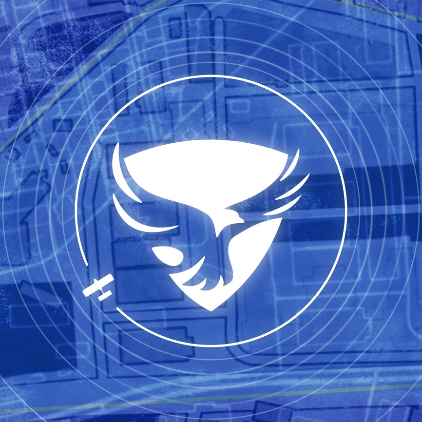

  

# Task 1 Electroincs

## Part One
- [`MOSFET Report`](./Electroincs/MOSFET/MOSFET.pdf)
- [`IGBT Report`](./Electroincs/IGBT/IGBT.pdf)
- [`High-side Switching and Low-side Switching`](./Electroincs/Low-side%20and%20High-side/High-side%20and%20Low-side%20Switching.pdf)

## Part Two

- [`NPN BJT Overvoltage Protection`](./Electroincs/Overvoltage/NPN%20Proteus/)
- [`NPN BJT Overvoltage Protection Report`](./Electroincs/Overvoltage/NPN%20Proteus/NPN%20Overvoltage.pdf)
- [`PNP BJT Overvoltage Protection`](./Electroincs/Overvoltage/PNP/)
- [`PNP BJT Overvoltage Protection Report`](./Electroincs/Overvoltage/PNP/PNP%20Overvoltage.pdf)

### Change branches to see the files

# Task 3 Image Processing

## Part One

- [`Sobel Opearator`](./image_processing/Reports/Sobel%20Filter/Sobel%20Filter.pdf)
- [`Laplacian Opearator`](./image_processing/Reports/Laplacian%20Filter/Laplacian%20Filter.pdf)
- [`Canny Edge Detector`](./image_processing/Reports/Canny%20Edge/Canny%20Edge.pdf)

## Part two

### [Gear Detection System](./image_processing/gear_detection_system.py)

# Task 4 Machine Learning

### [Color Classifier](./machine_learning/color_classifier.ipynb)

# Task 5 Microcontrollers

## Part One

- [`UDP`](./microcontrollers/Reports/UDP%20Protocol/UDP.pdf)
- [`CAN`](./microcontrollers/Reports/CAN%20Protocol/CAN.pdf)

## Part two

### [Mini Security System](./microcontrollers/mini_security_system/)